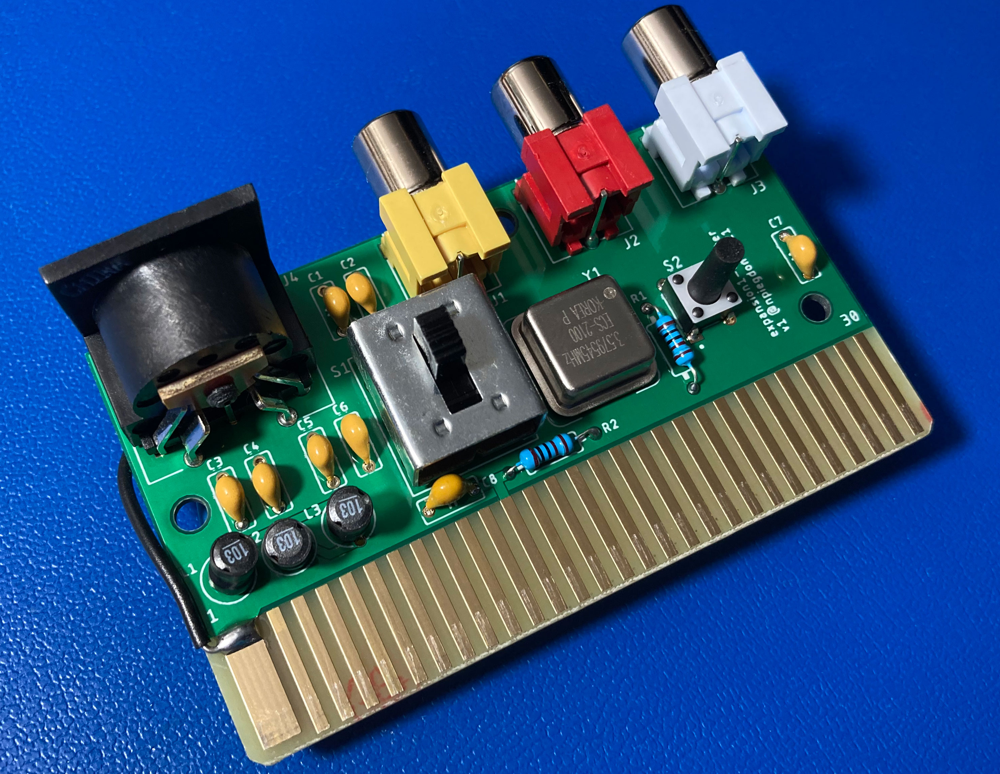
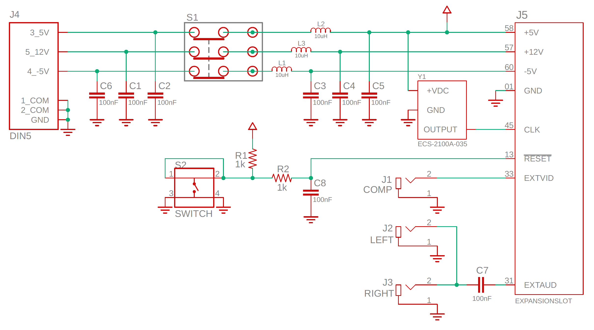

## ColecoVision Expansion Module #1 Stand-Alone Adapter 

**THIS PROJECT IS UNFINISHED AND DOESN'T WORK IN ITS CURRENT STATE!**

Inspired by [this AtariAge post](https://atariage.com/forums/topic/312955-expansion-module-1-standalone-project/) and because the Expansion Module #1 already has the whole card-edge connector exposed in the back, it seemed like it would be an improvement to make a simple card that could slot right into the back instead of drilling any holes (or even cracking the thing open).

Then, instead of a mod, it would be a simple little adapter box.

I laid the same circuit from the original post out on a new board, with the following changes:

1. The power input has been migrated to the "[best quality PS ever made for the ColecoVision](https://atariage.com/forums/topic/308050-285-watt-colecovision-compatible-power-supply-the-best-quality-ps-every-made-for-the-colecovision/)"  Mean Well GP25B13A-R1B power supply, which uses a DIN-5 connector.  The input voltages are already exactly correct, so the 5V regulator was dropped.  If you already own that replacement PSU for your ColecoVision, it can be used directly, as-is for your expansion module, too. 
2. Added the same power filtering present in the Colecovision.  (It's probably overkill, but better safe than sorry.)
3. The reset switch now employs simple debouncing.  The design in the AA post didn't have any and the ColecoVision itself uses a rather elaborate pulse-generator scheme, so I met in the middle and did the best I could with just a few passives.
4. All the parts are now sourced from Digi-Key (instead of several vendors), so they can be purchased in a single order.

## Unfinished Work

After building a prototype, it seemed to turn over just fine with the right voltages everywhere you might expect.  But while my Expansion Module #1 looks just fine when running through my ColecoVision, the output video was *very* dark when going through this adapter board.  Looking at the schematics for both, the video output from the expansion runs to exactly the point in the ColecoVision (RF header pin 6) where people are normally directed to tap the video signal when performing a composite video output mod.  So my guess is that this adapter board + the usual ColecoVision composite mod would do the trick.

I got most of the way through a breadboard implementation (with a THS7314 I had nearby), saw a too-bright picture, started to fiddle with trim pots, and eventually ran out of steam.  I was hoping for a simple board-layout project and not a protracted design project like [last time](https://tms-rgb.com), so I decided to cut my losses and post this here in its unfinished state.

So the only things missing before this could be considered complete:

1. Add the usual video amp with 75-ohm output just before the video output.
2. It might be nice to add the footprint for a TRRS jack (like [this one](https://www.digikey.com/product-detail/en/cui-devices/SJ-43514/CP-43514-ND/368146)) someplace on the board to give people an alternative to the RCA jacks.  It shaves about $3 off the $13 parts list and the same PCB could be used for both versions.
3. Design a 3D printable enclosure.

## Building One Anyway

It's all through-hole, every passive has the same value so you can't get anything mixed up, and the only part that could even be inserted the wrong way is the crystal oscillator.

### Parts

| part              | qty |   unit | model          | Digi-Key part | subtotal |
|:------------------|----:|-------:|:---------------|:--------------|---------:|
| Power switch      | 1   | $1.81  | GF-161-0005    | [CWI359-ND](https://www.digikey.com/product-detail/en/cw-industries/GF-161-0005/CWI359-ND/4089836)     | $1.81    |
| Reset switch      | 1   | $0.12  | 2-1825910-7    | [450-1642-ND](https://www.digikey.com/en/products/detail/te-connectivity-alcoswitch-switches/2-1825910-7/1632528)   | $0.12    |
| Oscillator        | 1   | $3.12  | ECS-2100A-035  | [XC235-ND](https://www.digikey.com/product-detail/en/ecs-inc/ECS-2100A-035/XC235-ND/31990)      | $3.12    |
| DIN5 port         | 1   | $2.63  | SDS-50J        | [CP-2350-ND](https://www.digikey.com/product-detail/en/cui-devices/SDS-50J/CP-2350-ND/97033)    | $2.63    |
| Composite L       | 1   | $1.36  | RCJ-042        | [CP-1419-ND](https://www.digikey.com/product-detail/en/cui-devices/RCJ-042/CP-1419-ND/408506)    | $1.36    |
| Composite R       | 1   | $1.36  | RCJ-043        | [CP-1420-ND](https://www.digikey.com/product-detail/en/cui-devices/RCJ-043/CP-1420-ND/408507)    | $1.36    |
| Composite Vid     | 1   | $1.36  | RCJ-044        | [CP-1421-ND](https://www.digikey.com/product-detail/en/cui-devices/RCJ-044/CP-1421-ND/408508)    | $1.36    |
| Inductor (10uH)   | 3   | $0.29  | 11R103C        | [811-2024-ND](https://www.digikey.com/product-detail/en/murata-power-solutions-inc/11R103C/811-2024-ND/1998211)   | $0.87    |
| Resistor (1k)     | 2   | $0.03  | jellybean      |               | $0.06    |
| Capacitor (0.1uF) | 8   | $0.03  | anything X7R   |               | $0.24    |
|                   |     |        |                | Total:        | **$12.93** |
